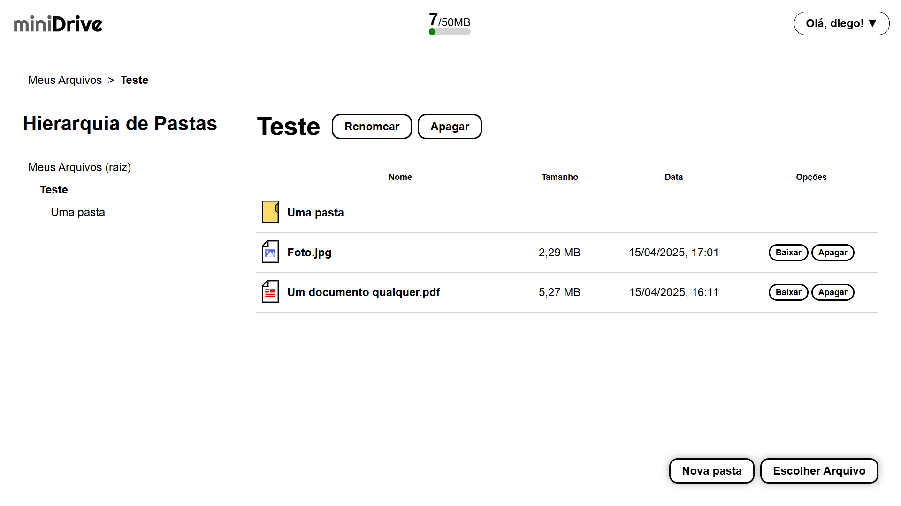

# miniDrive

**miniDrive** é uma aplicação web de armazenamento e compartilhamento de arquivos, inspirada em soluções como Google Drive e Dropbox.

Este projeto foi proposto pelo [The Odin Project](https://www.theodinproject.com/) como um desafio prático para consolidar conhecimentos em back-end, com foco no uso do ORM **Prisma**. Ao longo de meses de desenvolvimento, o projeto foi construído utilizando uma stack moderna de Node.js, Express e PostgreSQL, integrando recursos como autenticação, upload, pastas, e compartilhamento de arquivos.



---

## Funcionalidades

- Autenticação de usuários com Passport.js e sessões persistentes
- Upload de arquivos com suporte a limites definidos via `.env`
- Organização em pastas
- Compartilhamento de arquivos via links públicos
- Interface responsiva com EJS + SASS

---

## Tecnologias Utilizadas

- **Backend:** Node.js, Express.js
- **Frontend:** EJS, SASS
- **Banco de Dados:** PostgreSQL + Prisma ORM
- **Autenticação:** Passport.js (local)
- **Upload de Arquivos:** Multer
- **Compartilhamento:** Supabase
- **Outros:** Helmet, Compression, Morgan, UUID

---

## Instalação

```bash
# Clone o repositório
git clone https://github.com/Diego-Moreira8/mini-drive.git
cd mini-drive

# Instale as dependências
npm install

# Copie o arquivo de variáveis de ambiente
cp .env.example .env

# Edite o .env com suas credenciais

# Execute as migrações do banco de dados
npx prisma migrate dev

# Crie um bucket para os arquivos dos usuários no Supabase
npm run supabase

# Rode o servidor
npm run dev
```

## Scripts Disponíveis

| Script             | Função                                                   |
| ------------------ | -------------------------------------------------------- |
| npm run dev        | Inicia com nodemon para desenvolvimento                  |
| npm run sass       | Compila SASS em tempo real para desenvolvimento          |
| npm run build:sass | Compila e minifica os estilos                            |
| npm run migrate    | Aplica as migrações do Prisma                            |
| npm run build      | Executa build:sass e migrate                             |
| npm run supabase   | Cria um bucket para os arquivos dos usuários no Supabase |
| npm start          | Inicia o servidor em modo produção                       |

## Licença

Este projeto está licenciado sob a [MIT License](./LICENSE).

## Contato

Desenvolvido por Diego Moreira de Oliveira.
E-mail: [diego.moreira529@gmail.com](mailto:diego.moreira529@gmail.com)
Para sugestões, dúvidas ou feedbacks, sinta-se à vontade para abrir uma issue ou entrar em contato!
